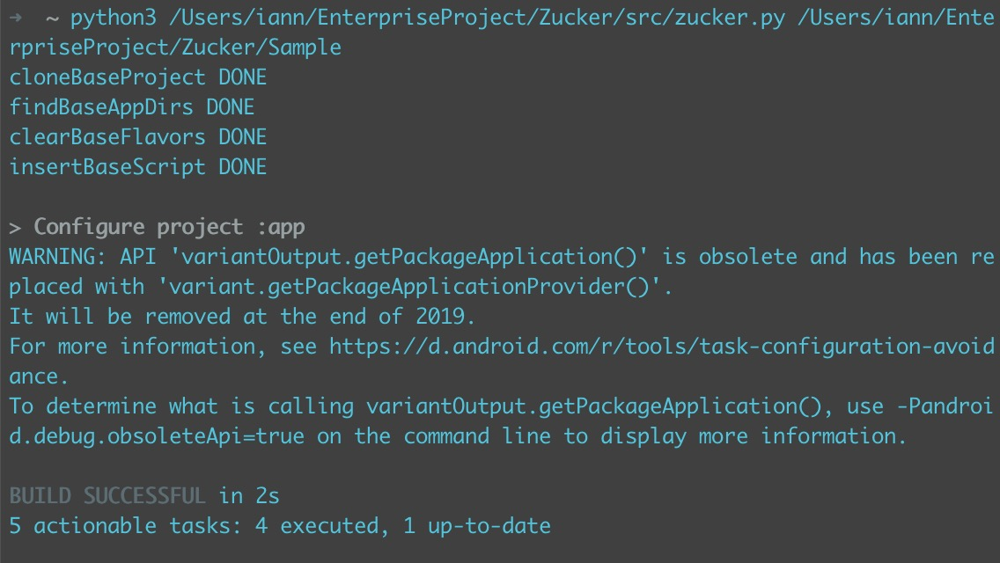
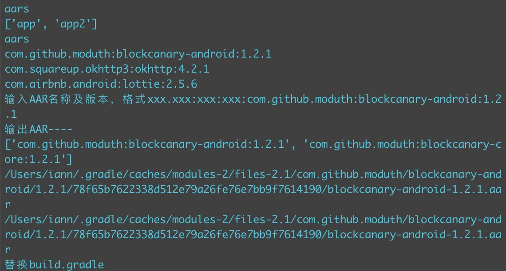
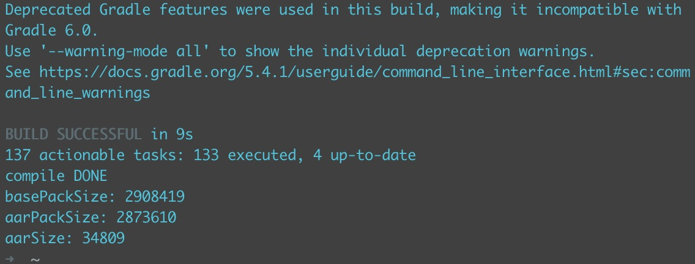

# Zucker：一个简单、自动化、准确的计算AAR在APK中大小方案

> 我们都知道在项目在引入AAR时，仅计算这个AAR文件大小是不准确的。因为在打包过程中会将aar解压，合并资源文件然后再进行压缩，实际在apk占用大小可能会小于当前aar文件大小。Zucker就是为了计算目标AAR在apk大小而生的

## 依赖环境
- Python 3.7+
- Android Dev
- Gradle 2.0+
- *unx/Windows

## 开始使用
### 环境准备
第一次使用Zucker进行AAR大小计算时建议先在命令行中编译一次。

编译时建议使用`gradlew`命令，以保证采用了项目的`gradle`配置
执行如下命令（首次运行时间较长，请耐心等待...）：

```
./gradlew build
```
在终端中执行如下命令：
```
python3 xxx/zucker.py xxx/targetProjectName(Android工程名)
```


脚本会自动执行，获取项目中的依赖关系并输出一级节点，可以选择目标节点进行AAR大小计算。



最后经过打包后，AAR大小就会显示在终端上。



>建议先在本项目的`simple工程`进行测试，具体流程见工程[README](Simple/README.md)


## 常见问题处理
 -  暂不支持工程依赖类型的测量 `implementation project(':xxx')` 
 -  在build过程中发生报错：Could not get resource 'https://jcenter.bintray.com/com/google/guava/guava/27.0.1-jre/guava-27.0.1-jre.jar'
 
 解决办法：使用阿里云镜像，重新进行下载；修改build.gradle中的buildscript和allprojects的jcenter，添加url 'https://maven.aliyun.com/repository/jcenter'即可。

## 贡献代码
详见 [CONTRIBUTING](CONTRIBUTING.rst)


## 许可协议


 Copyright Zucker

 Licensed under the Apache License, Version 2.0 (the "License"); you may
 not use this file except in compliance with the License. You may obtain
 a copy of the License at
     http://www.apache.org/licenses/LICENSE-2.0

 Unless required by applicable law or agreed to in writing, software
 distributed under the License is distributed on an "AS IS" BASIS, WITHOUT
 WARRANTIES OR CONDITIONS OF ANY KIND, either express or implied. See the
 License for the specific language governing permissions and limitations
 under the License.
